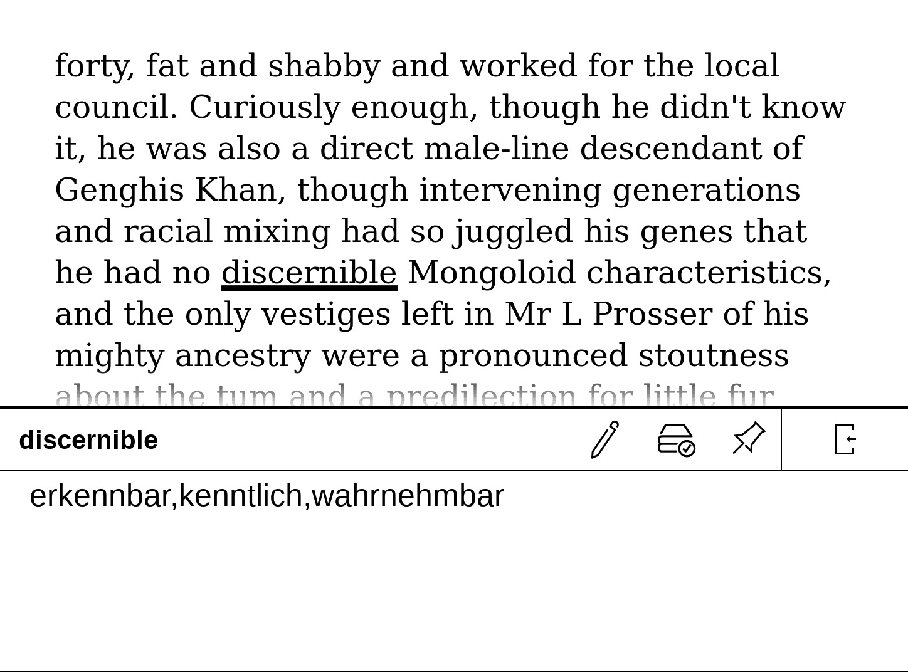

# POCKETBOOK DICTIONARY DICT.CC

## tl;dr
This tool generates a xdxf file from the dict.cc ENG-GER vocabulary, which can be converted to a dictionary for Pocketbook e-book readers.

## Still in progress, soon v2 will be merged to the main branch

   
*Passage from "Alice in Wonderland" by Douglas Adams*

A few years ago I bought a Pocketbook Touch HD 3 e-book reader and found it had a lousy standard dictionary. As a non-native speaker, I enjoy reading English books, so I occasionally need a translation of a word. The standard dictionaries on this device only provide basic vocabulary and therefore do not help me any further. Because of this problem, I looked around a little and only found expensive dictionaries that weren't big enough for my taste. After a little research I found out that you can now use stardict dictionaries if you use another reader application on your eBook reader. This instruction is for the classic way and here I decided to create my own dictionary based on the data provided by dict.cc.

Excerpt from the page ["About dict.cc"](https://www.dict.cc/?s=about%3A&l=e):
> [...]   
> All services offered by dict.cc can be used in the web browser for free, both for private and business purposes. All other ways of usage, particularly automated requests (parsing) require express permission.    
> [...]   

Therefore I do not offer the finished dictionary for download, you have to download the vocabulary file from dict.cc yourself.

The instructions were rewritten and tested in March, 2025 for the ENG-GER data (English to German). If I have the time and feel like it, I will provide assistance, but cannot guarantee it. Feel free to add new languages ​​to this script or improve it elsewhere.

### How to create a (translation) dictionary for Pocketbook eBook Readers:
(These instructions have only been tested with the Pocketbook Touch 3, but the newly created dictionaries should work on all Pocketbook devices.)

1. Download the translation text file from [dict.cc](https://www1.dict.cc/translation_file_request.php) (for private use only, so you cannot download the finished dictionary in this repository.)
    - If you don't want to deal with this tool or these instructions, [download it directly](https://www1.dict.cc/download/pocketbook-dict-cc-en-de.zip) the finished dictionary from dict.cc and copy and paste it into your e-book reader as described in step 5 (note, however, that this dictionary is not as comprehensive as the one you can create yourself with this instruction).
2. Unzip the downloaded archive, and run the tool (after cloning this repo 🤓) with the vocabulary file as input ´python3 ./convert_dict.py -i ./vocabulary.txt´:
´´´
  -h, --help            show this help message and exit
  -i INPUT_VOCABULARY, --input_vocabulary INPUT_VOCABULARY
                        Path to dict.cc vocabulary file.
  -d DB_FILE, --db_file DB_FILE
                        Path to the SQLite database file.
  -o OUTPUT_FILE, --output_file OUTPUT_FILE
                        Path to save the xdxf file.
´´´
No need to specify the database nor output file, as those will be automatically generated. You can specify them. If you run the tool with an existing database, it will ignore the input file and just creates the xdxf file from the database.
3. Get some coffee, read a book, or clean your kitchen - it will take some time. In my case it took precisly 126m29,468s on a i5-8365U CPU @ 1.60GHz, combined with 16GB RAM. Still slow, but faster than the previous version of this tool and I take this as a win.
4. Now we need to convert the newly created `<name>.xdxf`1 file with converter.exe
    - You can download converter.exe here: [Mobileread forum](https://www.mobileread.com/forums/showpost.php?p=3923322&postcount=6), there are a few different versions of this tool on this forum. I tested couple versions and this one just works fine with [wine](https://www.winehq.org/)
    - Copy your `*.xdxf` file into the extracted directory of the converter. There should be an executable file and a folder names `en`. You can get the needed files for the converter from [Markismus Language Repository](https://github.com/Markismus/LanguageFilesPocketbookConverter). These are needed for the converter.
    - Run cmd or Powershell under Windows or with wine: `wine ./converter.exe ./<name>.xdxf en` (set paths correct for your os)
5. Copy the new dictation file on your Pocketbook reader in `/system/dictionionaries/<name>.dic`

Good luck and much fun with your new dictionary

1 Further information on the xdxf standard: [https://github.com/soshial/xdxf_makedict](https://github.com/soshial/xdxf_makedict)
