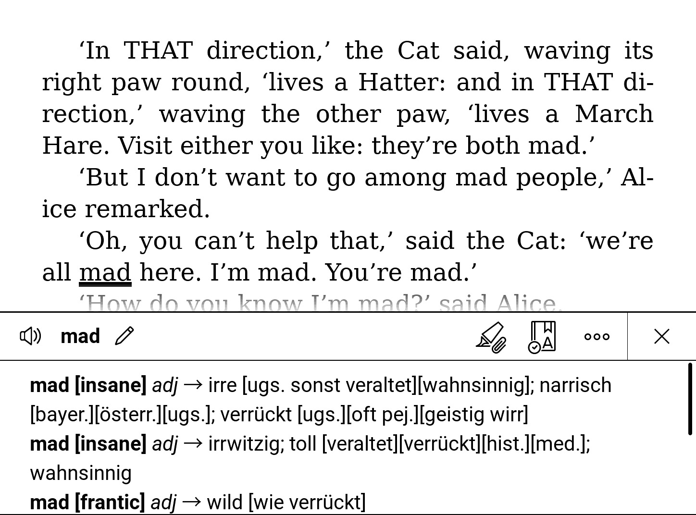

# POCKETBOOK DICTIONARY DICT.CC

    

A few years ago I bought a Pocketbook Touch HD 3 e-book reader and found it had a lousy standard dictionary. As a non-native speaker, I enjoy reading English books, so I occasionally need a translation of a word. The standard dictionaries on this device only provide basic vocabulary and therefore do not help me any further. Because of this problem, I looked around a little and only found expensive dictionaries that weren't big enough for my taste. After a little research I found out that you can now use stardict dictionaries if you use another reader application on your eBook reader. This instruction is for the classic way and here I decided to create my own dictionary based on the data provided by dict.cc.

Excerpts from the page ["About dict.cc"](https://www.dict.cc/?s=about%3A&l=e):
> [...]   
> All services offered by dict.cc can be used in the web browser for free, both for private and business purposes. All other ways of usage, particularly automated requests (parsing) require express permission.    
> [...]   

Therefore I do not offer the finished dictionary for download, you have to download the vocabulary from dict.cc yourself.

The instructions were developed and tested on January 7, 2021 for the ENG-GER data (English to German). If it doesn't work, you are out of luck. If I have the time and feel like it, I will provide assistance, but cannot guarantee it. Feel free to add new languages ​​to this script or improve it elsewhere.

### How to create a (translation) dictionary for Pocketbook eBook Readers:
(These instructions have only been tested with the Pocketbook Touch 3, but the newly created dictionaries should work on all Pocketbook devices.)

1. Download the translation text file from [dict.cc](https://www1.dict.cc/translation_file_request.php) (for private use only, so you cannot download the finished dictionary in this repository.)
    - If you don't want to deal with this tool or these instructions, [download it directly](https://www1.dict.cc/download/pocketbook-dict-cc-en-de.zip) the finished dictionary from dict. cc  1  and copy and paste it into your e-book reader as described in step 5 (note, however, that this dictionary is not as comprehensive as the one you can create yourself).
2. Unzip the downloaded archive, place the text file next to the Python file (after cloning this repo 🤓) and rename it to "lex.txt".
3. Run "python3. / Parser.py" in the dictionary that "lex.txt" and "parser.py" are in and get some coffee, read a book, or clean your kitchen - it will take some time
4. Now we need to convert the newly created `lex.xdxf`1 file with converter.exe
    - You can download converter.exe here: [Mobileread forum](https://www.mobileread.com/forums/showpost.php?p=3923250&postcount=3), there are a few different versions on this forum: I have tested two different ones and the result were exactly the same
    - Copy your `lex.xdxf` file into the extracted directory of the converter. There should be an executable file and some folders like `ger` or `eng`.
    - Run cmd or Powershell under Windows or with Wine (does not work on my machine): `./converter.exe ./lex.xdxf eng`
5. Copy the new dictation file on your Pocketbook reader in `/system/dictionionaries/lex.dic`

Good luck and much fun with your new dictionary

1 Further information on the xdxf standard: [https://github.com/soshial/xdxf_makedict](https://github.com/soshial/xdxf_makedict)
